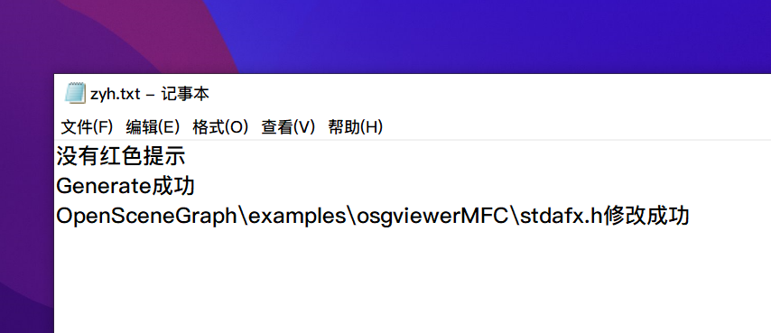
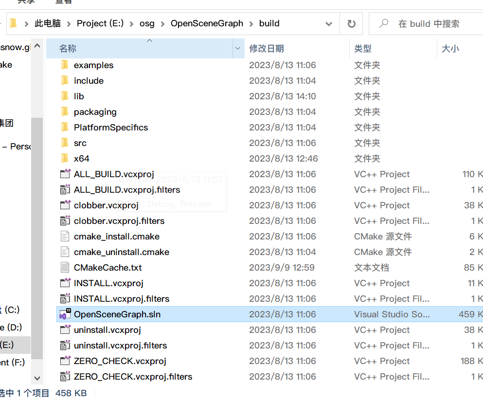

# 1.项目介绍

此项目是用来快速完成osg的cmake配置

# 2.使用说明

> 基于电脑上有VS2022，否则不能用
>
> 记得提前在VS2022安装MFC组件，具体安装方式自行搜索引擎

首先下载osg源码，源码有三个文件夹，如图所示，注意这几个压缩包名字是否和我的一致

然后一个个解压他们，注意是“解压到当前文件夹”这一步很重要

现在你应该看到的是这六个，注意看解压出来的三个文件夹名字是否和我的一样，不一样的话我的程序你不能使用

然后把我的程序OsgCmake.exe放进去这个文件夹中，双击执行即可

执行完后，会在桌面产生一个zyh.txt，如果cmake配置成功并且generate成功后，txt文件里面会显示

> 没有红色提示
> Generate成功
>
> OpenSceneGraph\\examples\\osgviewerMFC\\stdafx.h修改成功

现在可以进入到OpenSceneGraph\build目录下打开sln了

打开后 生成-批生成，这一步很久需要3，4小时吧

一般来说如果你电脑安装的有MFC组件，就不会报错，会生成成功，之后再看这个博客的[osg环境部署 ](https://blog.csdn.net/qq_43718758/article/details/129486298)的第四步配置环境变量即可，注意在按照他的来配置用户环境变量时，OpenSceneGraph-Data我们的会再更深一级

