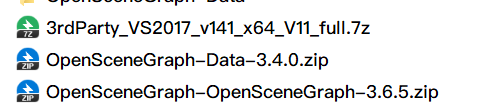
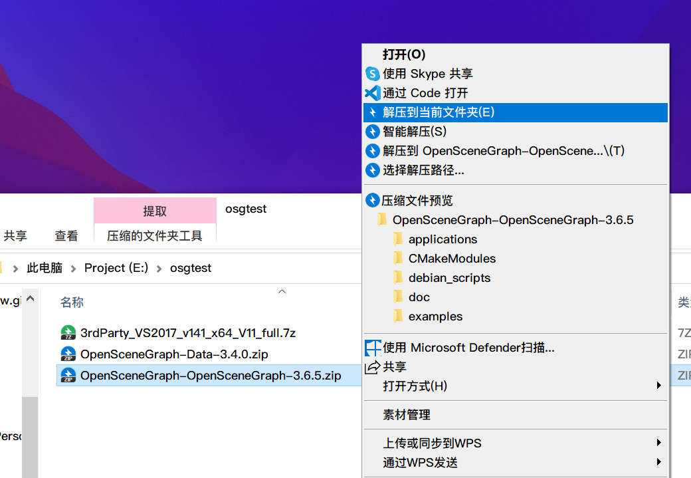
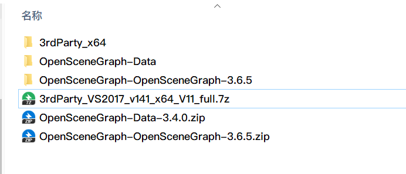
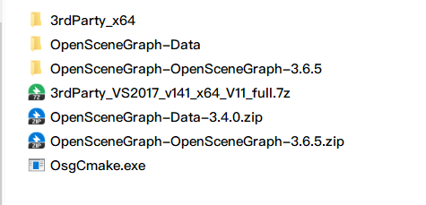
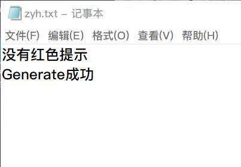

# 1.项目介绍

此项目是用来快速完成osg的cmake配置

# 2.使用说明

> 基于电脑上有VS2022，否则不能用

首先下载osg源码，源码有三个文件夹，如图所示，注意这几个压缩包名字是否和我的一致

然后一个个解压他们，注意是“解压到当前文件夹”这一步很重要

现在你应该看到的是这六个，注意看解压出来的三个文件夹名字是否和我的一样，不一样的话我的程序你不能使用

然后把我的程序OsgCmake.exe放进去这个文件夹中，双击执行即可

执行完后，会在桌面产生一个zyh.txt，如果cmake配置成功并且generate成功后，txt文件里面会显示

> 没有红色提示
> Generate成功

此时是完成了[osg环境部署](https://blog.csdn.net/qq_43718758/article/details/129486298)博客的前两步，接下来看它的第三步：使用vs2017开始批生成，就可以了，它里面的环境变量配置有点问题，配置时注意它的路径和你的路径是否一样

